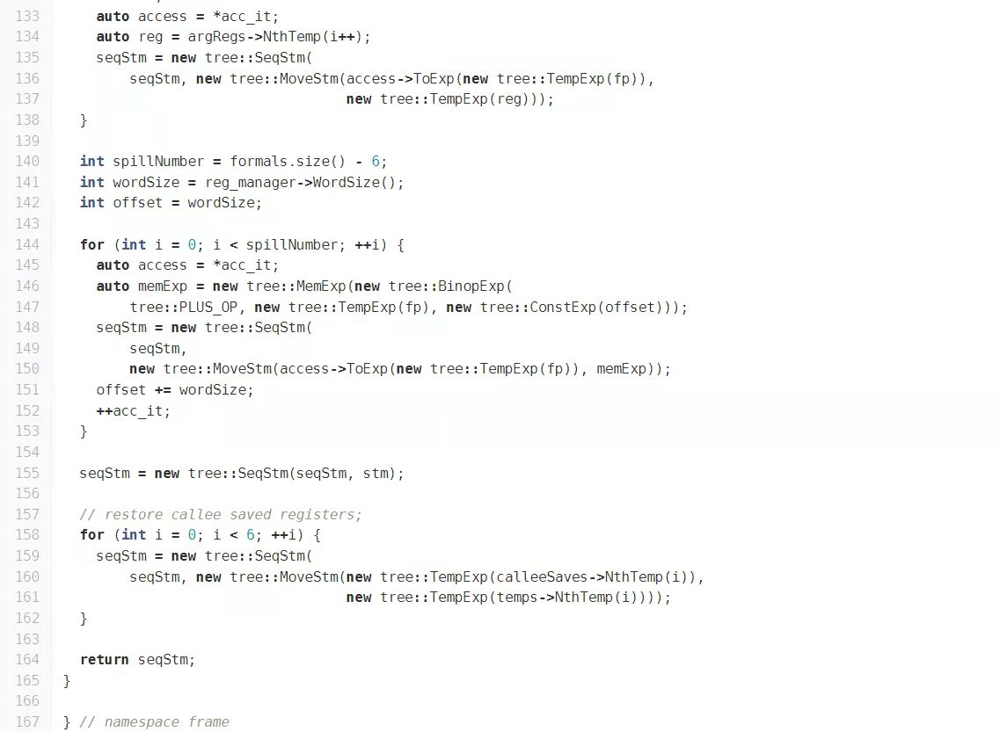
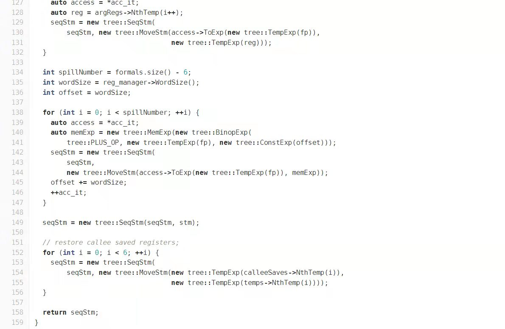

# Hall Of Shame

本 repo 记录学术不端行为。欢迎 PR。

## Contribution Guide

TODO

## Latest

* 2020-11-12 上海某 Top2 高校 / 计算机系 / 某实验课程优秀作业全篇未标注照搬 QEMU 源代码，当事人胡同学拒不承认。 [链接](2020-11-12-QEMU)
  * 附件内容：作业原文，聊天记录
  * 抄袭内容：[qemu/qemu@46cd1e8](https://github.com/qemu/qemu/commit/46cd1e8a4752379b1b9d24d43d7be7d5aba03e76)

+ 2022/1/11 上海西南某高校软件学院某群学生肆无忌惮地进行lab抄袭，其恒心毅力着实令人惊叹，从lab1抄袭到lab4。甚至不惜蹲点抄袭。他们的行为真是不忘初心呢。甚至为了严谨性，对代码进行照搬，甚至连变量名和注释都不改。

  被抄袭者的lab内容：

  

  抄袭者的lab内容

  

